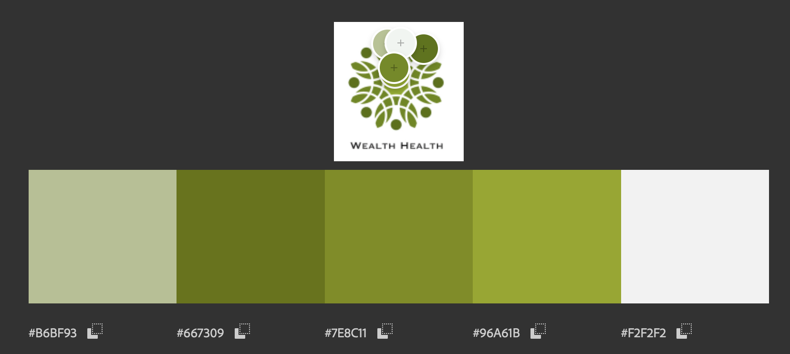

# Application HRNet en React

Ce projet est une conversion de l'[application HRNet originale](https://github.com/OpenClassrooms-Student-Center/P12_Front-end), conçue pour gérer les dossiers des employés pour WealthHealth. Cette version mise à jour remplace jQuery par des composants React afin d'améliorer les performances, la maintenabilité et l'expérience utilisateur.

## Fonctionnalités

- **Sélecteur de Date** : Utilise `react-datepicker` pour sélectionner des dates dans le formulaire des employés.
- **Modal** : Utilise `react-modal` pour les dialogues de confirmation.
- **Tableau de Liste des Employés** : Construit avec `react-table` pour un tableau interactif performant.
- **Menus Déroulants** : Implémenté en utilisant le package personnalisé [`@hotp0t/dropdown-package`](https://www.npmjs.com/package/@hotp0t/dropdown-package) pour gérer efficacement les sélections de départements et d'États.
- **Gestion d'État Globale** : Gère les données des employés avec l'API Context de React.
- **API Mock** : Utilise `json-server` pour simuler un backend, fournissant une persistance pour les dossiers des employés à travers les sessions de l'application.

## Structure des Dossiers

- `src/`
  - `pages/` - Contient des composants de pages tels que `CreateEmployee` et `EmployeeList`.
  - `EmployeeContext.js` - Configure le contexte pour gérer l'état global des employés.
  - `index.js` - Initialise l'application et l'enveloppe dans le `EmployeeProvider`.
  - `App.js` - Composant principal de l'application qui gère le routage et la mise en page générale.
- `public/`
  - `images/` - Contient l'image de la palette de couleurs.
  - `index.html` - Fichier HTML principal.
  - `manifest.json` - Manifest de l'application web.
  - `robots.txt` - Directives pour les robots.
- `db.json` - Base de données mock pour json-server.

## Documentation des Composants

### `CreateEmployee.js`
Ce composant gère le formulaire d'ajout d'un nouvel employé. 
- **Gestion des états** : Utilise `useState` pour gérer les données du formulaire (prénom, nom de famille, date de naissance, etc.).
- **Modal** : Affiche une fenêtre modale pour confirmer la création de l'employé.
- **Dropdowns** : Utilise le package personnalisé [`@hotp0t/dropdown-package`](https://www.npmjs.com/package/@hotp0t/dropdown-package) pour gérer les sélections de départements et d'états.
- **Soumission du formulaire** : Lors de la soumission, les données sont envoyées au contexte pour ajout à la liste des employés.

### `EmployeeList.js`
Ce composant affiche la liste des employés ajoutés.
- **Récupération des données** : Utilise le contexte pour accéder à la liste des employés et les affiche dans un tableau.
- **Affichage dynamique** : Les employés sont présentés dans un tableau, permettant une visualisation facile.

### `EmployeeContext.js`
Ce fichier configure le contexte global pour la gestion des employés.
- **Gestion d'état global** : Utilise `useContext` et `useState` pour gérer l'état des employés dans toute l'application.
- **Fonctions d'action** : Définit des fonctions pour ajouter des employés via une API simulée avec `json-server`.

### `App.js`
Ce composant principal gère la navigation de l'application.
- **Routing** : Utilise `react-router-dom` pour gérer la navigation entre la création d'employés et la liste des employés.
- **Provider** : Enveloppe l'application dans `EmployeeProvider` pour fournir un accès global à l'état des employés.

## Mise en Route

### Prérequis

- Node.js et npm installés.

### Installation

1. Clonez le dépôt:

   ```bash
   git clone https://github.com/HOTP0T/OCR_P14_JQueryReact
   cd OCR_P14_JQueryReact
   ```

2. Installez les dépendances:

   ```bash
   npm install
   ```

3. Démarrez le serveur mock API:

   ```bash
   npm run json-server
   ```

4. Démarrez l'application:
   ```bash
   npm start
   ```

### Utilisation

- **Créer un Employé** : Allez sur la page d'accueil pour ajouter de nouveaux employés.
- **Voir les Employés** : Cliquez sur "Voir les Employés Actuels" pour voir la liste des employés.

## Scripts Disponibles

- `npm start` - Exécute l'application en mode développement.
- `npm run build` - Construit l'application pour la production.
- `npm run json-server` - Démarre le serveur mock API pour la persistance.

## Palette de couleurs

